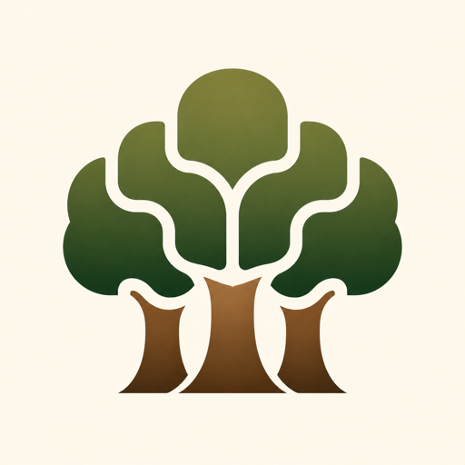

<section class="grove-hero" markdown>

# Grove



<p class="grove-tagline">A lean Python Blossom server for opaque, content-addressed blobs.</p>

<p class="grove-intro">Grove stores bytes exactly as supplied, verifies their SHA-256 identity, and uses signed Nostr authorization to manage ownership.</p>

[Get started](getting-started.md){ .md-button .md-button--primary }
[View the source](https://github.com/trbouma/grove){ .md-button }

</section>

## Storage beneath a simple canopy

Grove is a deliberately small implementation of the
[Blossom protocol](https://github.com/hzrd149/blossom). It provides the storage
boundary an application needs without trying to become a media platform,
identity provider, key custodian, or general cloud drive.

<div class="grove-grid" markdown>

<article class="grove-card" markdown>

### Content addressed

Every blob is named by the SHA-256 digest of its exact bytes. Grove hashes each
upload while streaming it and rejects content that does not match the signed
expected digest.

</article>

<article class="grove-card" markdown>

### Nostr authorized

Uploads, owner listings, and deletion use signed kind `24242` authorization
events. Grove verifies the event ID, BIP-340 signature, action, expiry, server
scope, and blob hash.

</article>

<article class="grove-card" markdown>

### Operationally modest

One Python process, a local filesystem, and SQLite provide a comprehensible
deployment for a personal server, community service, or appliance.

</article>

</div>

## Grove does not need to know what it holds

Grove stores opaque bytes. It can observe ciphertext, hashes, sizes, media
types, uploader public keys, timing, network metadata, and access patterns, but
it does not receive Acorn private keys or attachment-encryption keys.

```text
private file -> Acorn encrypts -> opaque ciphertext -> Grove stores
                      |
                      +-> encrypted private record on a relay
                          contains the key and blob reference
```

This division is intentional. **Acorn owns confidentiality; Grove provides
content-addressed availability.** A generic Blossom client can still upload
plaintext, so confidentiality is a property of the client path—not a claim
Grove makes about every stored blob.

[Understand the Acorn boundary](acorn-integration.md){ .md-button }
[Read the security statement](security.md){ .md-button }

## Implemented today

Grove implements retrieval, range requests, streaming upload, upload
preflight, Nostr authorization, authenticated owner listing, and owner-scoped
deletion across BUD-01, BUD-02, BUD-06, BUD-11, and BUD-12.

It intentionally does not yet implement mirroring, media transformation,
payments, reports, quotas, or external object storage. The current local
filesystem and SQLite design is for a single Grove process.

[Review the protocol surface](protocol-surface.md){ .md-button .md-button--primary }
[See project status](project-status.md){ .md-button }
